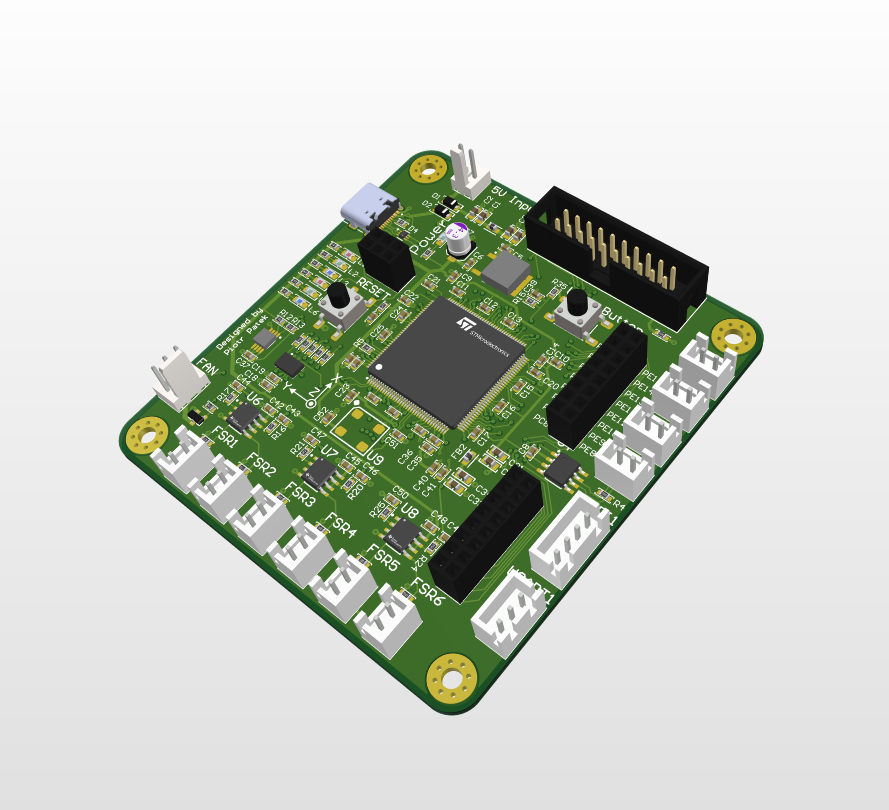
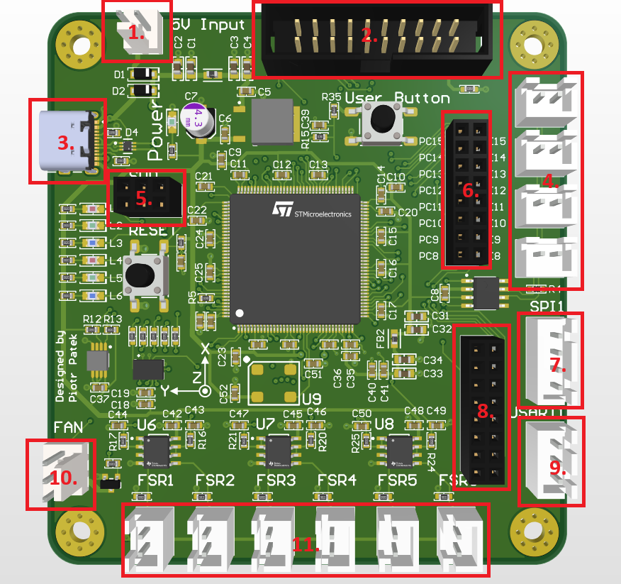
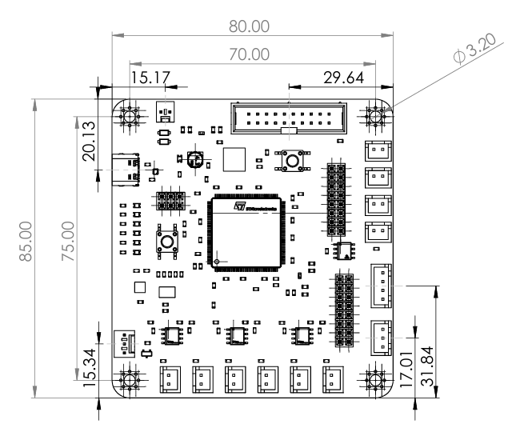
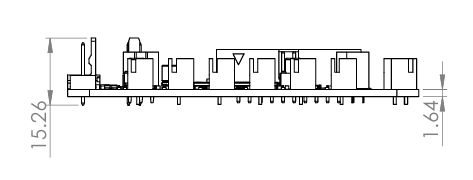

# Elkapod Hardware Controller module repository

Elkapod Hardware Controller is a module responsible for communication and control of hardware layer of Elkapod walking robot.

It abstracts components such as power supply module, servomotors, force sensors for main onboard computer - Raspberry Pi 5 - providing neat and standarized system interface.

Electronic schematics as well as mechanical drawing are available in the `docs/` folder.

## Components
Elkapod Control Module is equipped with **STM32F446ZET6** microcontroller clocked at 180MHz which lets it handle even most demanding tasks.

### User interface
User may interfact with the board using dedicated **User button**.
Along with 6 controllable LEDs with different colors it makes prototyping and debugging process easier. 
The colors are:
- L1, L2 -  **red**
- L3, L4 -  **green**
- L5, L6 -  **blue**

### Sensors
#### Inertial measurement unit (IMU)
The module has **BMI055** Bosch sensortech inertial measurement unit used for measuring current orientation of the PCB, and, thus orientation of the Elkapod's main body.

Because it is vital to have a reliable and fast response to changes in the robot's orientation, the BMI055 is connected to the MCU using an SPI bus.

#### Temperature sensor
Temperature of the environment in which the module is located is measured using MCP9808-E/MS temperature sensor connected to the MCU using I²C bus.

### Connections

The list of connections and their numbering according to the drawing above:
1. **KK power connector** - used for powering the module - power supply requirements (5V / 1.5A)
2. **IDC20 connector** - outputs PWM signals for 18 servomotors connected to the power supply board

  

3. **USB type C connector** - used for powering the module and communication and diagnostics. Supports only USB 1.0 standard (transfer up to 12MBit/s)
4. **CAN 2.0 connectors** -  4 connectors for CAN communication using the 2.0 standard. It is important that the first device connected to the first upper connector is equipped with a 120Ω terminal resistor at the end of the line. Other devices should not have terminal resistors at their endpoints.
5. **SWD** connector - used for programming and debugging.

  

6. **GPIO connector 1** - generic use GPIO I/O

  

7. **SPI1 connector** - SPI bus connector used for high-speed communication with Raspberry Pi 5 

  

8. **GPIO connector 2** - SPI bus connector used for high-speed communication with Raspberry Pi 5 

  

9. **USART1 connector** - USART / UART connector used for peer - peer full-duplex communication with Raspberry Pi 5

  

10. **FAN connector** - KK connector for external FAN. Power parameters - 5V / up to 0.5A

  

11. **Force Sensitive Resistor connectors** - connectors for FSR402 force sensitive resistors

## Mechanical drawing

  

  

